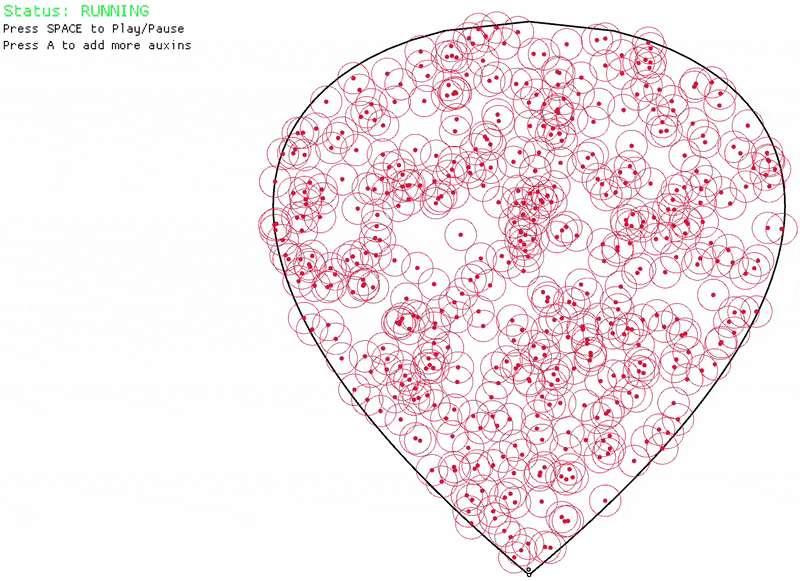

# Venation Pattern Generator


A procedural simulation of leaf vein growth based on the Space Colonization Algorithm, as described by Runions et al. in [Modeling and visualization of leaf venation patterns](https://algorithmicbotany.org/papers/venation.sig2005.pdf). <br>



## Algorithm
The algorithm operates on two primary entities:
1.  Auxins: Points distributed randomly within the leaf shape. They act as attractors for the veins.
2.  Veins: The building block of the network. Veins grow towards the nearest auxins.

### Properties
**Attraction:** Each auxin finds the closest vein node within a maximum radius (`DIST_MAX`).  <br>
**Direction:** The chosen vein node calculates a growth vector toward all auxins influencing it.  <br>
**Growth:** A new vein node is created in the direction of the calculated vector, extending the network.  <br>
**Depletion:** When a vein node grows close enough to an auxin (within `PROXIMITY_THRESHOLD`), that auxin is "consumed" and removed from the simulation.

## Usage

Build from source
(requires [rust & cargo](https://rustup.rs/)).
```bash
git clone https://github.com/Gyrandola/Leaf-Venation-Patterns.git
cd Leaf-Venation-Patterns && cargo run --release
```

Alternatively download and run the [latest release](https://github.com/Gyrandola/Leaf-Venation-Patterns/releases).

## Controls

| Key | Action |
| :--- | :--- |
| **SPACE** | Toggle Pause / Play. The simulation starts paused. |
| **A** | Generate and distribute additional auxins within the leaf boundary. |
| **ESC** | Exit the application. |

## Configuration


`LEAF_SCALE` (Default: `1000.0`): Size multiplier for the leaf.

### Veins
`VEIN_RADIUS` (Default: `4.0`): Visual radius of the vein nodes. <br>
`VEIN_INNER_COLOR` / `VEIN_OUTER_COLOR`: Colors used to draw the vein segments.  <br>
`VEIN_GROWTH_RATE` (Default: `8.5`): The distance a new vein node travels from its parent node during a single growth step.

### Auxins
`AUXIN_RADIUS` (Default: `4.0`): Visual radius of the auxins.  <br>
`AUXIN_COLOR` (Default: `RED`): Color of the auxins. <br>
`AUXIN_STARTING_NUMBER` (Default: `250`): The initial number of auxins generated when the program starts. <br>
`AUXIN_GENERATE_NUMBER` (Default: `100`): The number of new auxins injected into the leaf when the `A` key is pressed.

### Algorithm
`PROXIMITY_THRESHOLD` (Default: `VEIN_RADIUS + AUXIN_RADIUS + 5.0`): The distance at which a vein "consumes" an auxin. Once a vein is within this radius, the auxin is deleted.  <br>
`SHOW_PROXIMITY_THRESHOLD` (Default: `true`): Renders a hollow circle around each auxin to visualize the kill zone.  <br>
`DIST_MAX` (Default: `200.0`): The maximum distance an auxin can be from a vein to exert an attractive force. 

## Dependencies
[Macroquad](https://macroquad.rs/)

## References
Runions, A., Fuhrer, M., Lane, B., Federl, P., Rolland-Lagan, A. G., & Prusinkiewicz, P. (2005). [Modeling and Visualization of Leaf Venation Patterns](https://algorithmicbotany.org/papers/venation.sig2005.pdf).
